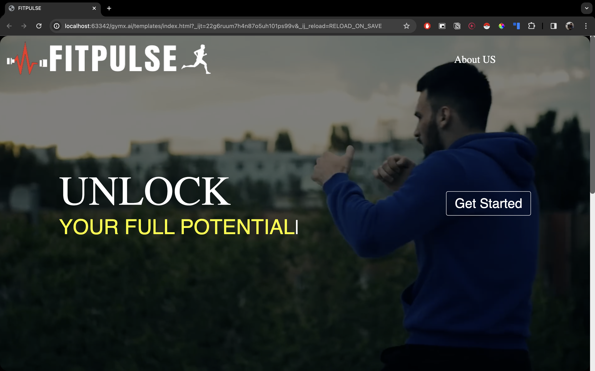
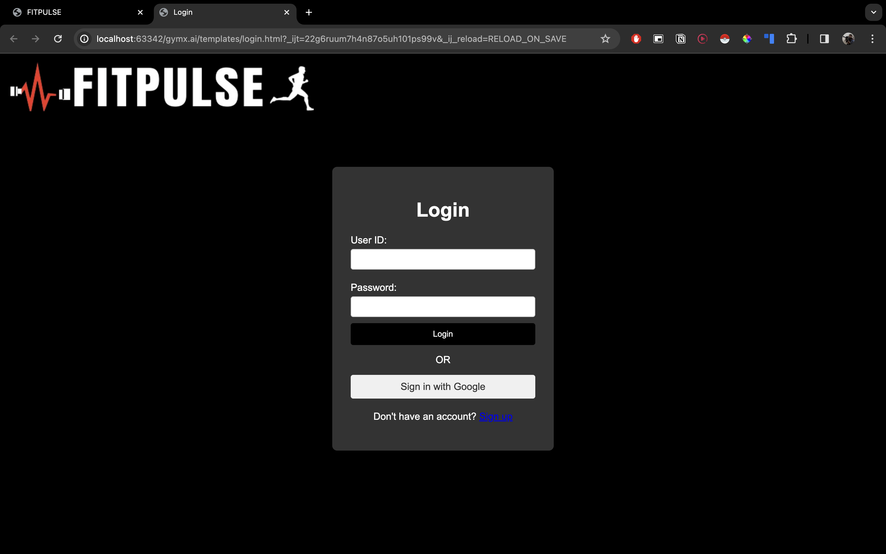
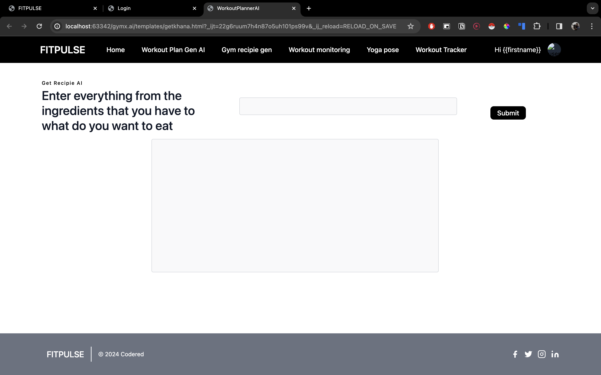

#FITPULSE- AI POWERED FITNESS AND WELLNESS SYSTEM

FitPulse is an innovative AI platform offering multiple features including real-time pose correction for workouts, customized and bespoke Fitness training plans and diet plans tailored to the user's need and accessibility.
Visually appealing tool catering to the needs workout monitoring and tracking.

This tool has been built on 4 main verticals:
- Fitness Planner
Customized workout planning according to the gym availability, time availability, user data like age, height and weight and the type of workout the user is comfortable with.
- Diet and Recipe Planner
Customized diet and dish recommendations along with their recipes. The user can input his own ingredients and can be catered to an exquisite variety of dishes.
- Workout Monitor
Real-time workout monitoring with features like pose correction, injury prevention, efficiency monitoring, rep coiunter and so on.
- Workout Tracker
Over a period of time, based on user's consistency and the user profile, one can track his/her calory burn, weight loss/gain and so on.
#####This is how the landing page of the tool looks like.

#####When getting started, the user is prompted to login. The login page looks like this.

The user can either choose to login through their google accounts, or choose to create one with FITPULSE.
> Only google login feature is enabled in the latest version, any changes shall be updated in the docs.

#####After login, The user is prompted with a questionnaire which helps in gathering the required data

#####Once answered the questionnaire, the dashboard looks like this.

#####These are the modules and the tech stack used to build this tool.
######Flask,Google-O-Auth,OpenCV,MediaPipe,Langchain,Tensorflow,Gemini-Pro

#####These are the steps to clone the repo and run locally.

`git clone`
`cd gymx.ai`
##### create virtual environment
`pip install -r requirements.txt`
`run app.py`
`run main.py`
##### Open Yoga module in different window
##### Create virtual environment
`pip install -r requirements.txt`
`run app.py`

##### The app is live at http://127.0.0.1:5000/

